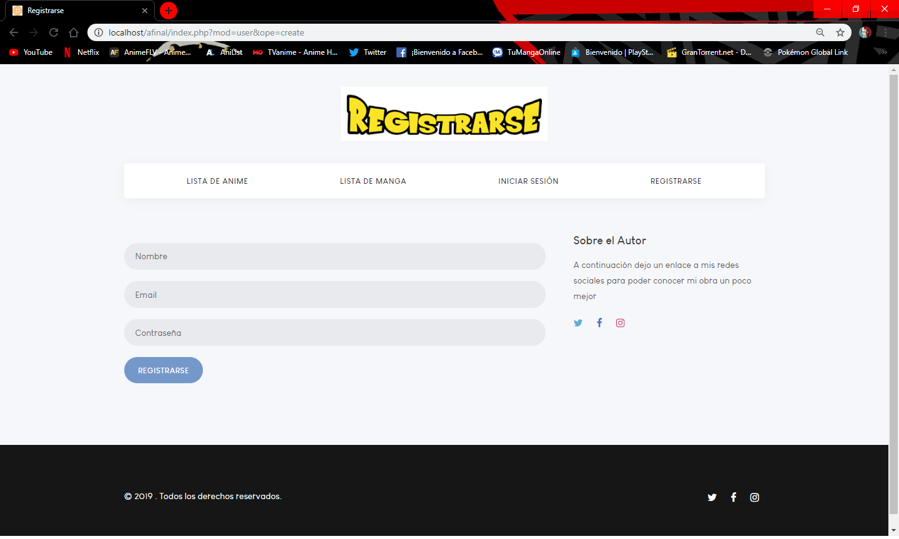

# Lista de Anime

**Pantalla de Inicio**

Esta será la página a la cual llegaremos cuando entremos en la url de la página [Lista de Anime](http://listanime.epizy.com).
En ella se muestra el listado de los animes.

**Pantalla de Lista de Manga**

En esta página podemos ver el listado de los Mangas.

**Pantalla de Registro**

Esta es la pantalla que aparecera si pulsamos el botón de Registrarse.

**Pantalla de Inicio de Sesión**

Esta es la pantalla que aparecera si pulsamos el botón de Inicio de Sesión.

**Pantalla Una vez el Usuario este Registrado e Iniciado Sesión**

En esta pantalla podemos observar diferencias entre los usuarios registrados y los que no, como ver los detalles del anime/manga y poder agregarla a su propia

**Pantalla de la vista de Anime/Manga y poder escribir comentarios**

En esta podemos ver los datos del manga/anime y los comentarios dejados y poder escribir uno nosotros

**Pantalla de Lista personal de Anime/Manga**

Aqui podremos ver que serie está en nuestra lista personal (cada usuario tendra la suya propia)

**Pantalla de Admin**

Una vez que iniciamos sesión con un administrador, podremos ver el listado de Anime/Manga de los cuales podremos borrar, actualizar o crear uno nuevo

